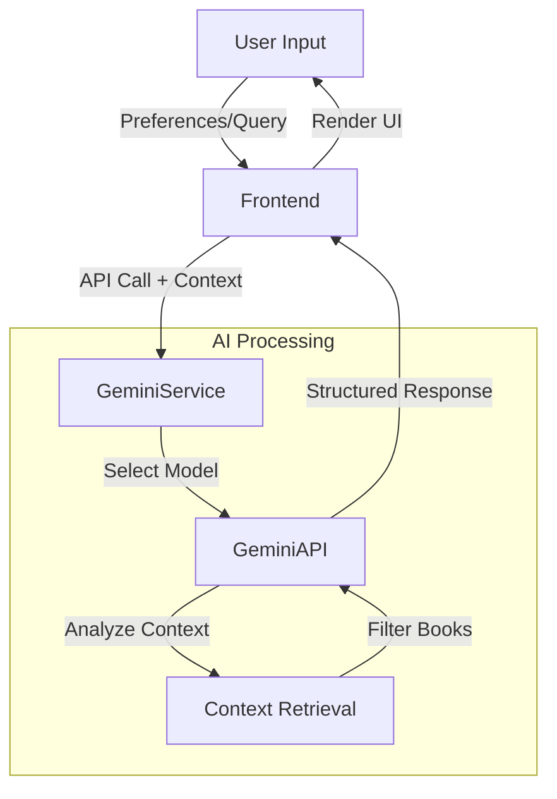
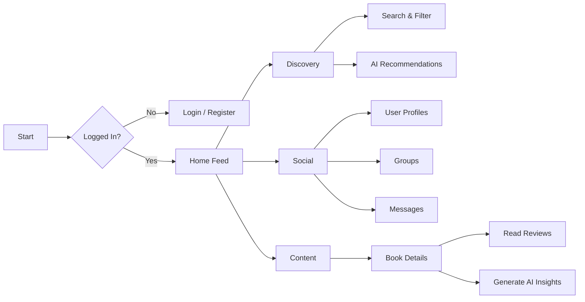

# 📚 BookNook

> **A modern, AI-powered social platform for book lovers.**


**BookNook** is a feature-rich web application that reimagines the online reading community. It seamlessly blends social networking features with robust library management and cutting-edge **Google Gemini AI** integration to help users discover, discuss, and dive deeper into their favorite stories.

---

## 📖 Table of Contents

- [Overview](#-overview)
- [Key Features](#-key-features)
- [AI Integration](#-ai-integration)
- [System Architecture](#-system-architecture)
- [Project Structure](#-project-structure)
- [Tech Stack](#-tech-stack)
- [Getting Started](#-getting-started)
- [Usage Guide](#-usage-guide)
- [License](#-license)

---

## 🔭 Overview

BookNook solves the problem of "what to read next" by combining community wisdom with artificial intelligence. Users can follow friends, join clubs, track their reading, and interact with an AI assistant that understands the nuance of literary vibes.

The application is built as a **Single Page Application (SPA)** using React 19, designed with a "cozy academic" aesthetic that supports multiple visual themes.

---

## ✨ Key Features

| Feature Category | Description | Status |
| :--- | :--- | :--- |
| **User Profiles** | Customizable profiles, reading stats, activity feeds, and follow/unfollow capabilities. | ✅ Ready |
| **Social Discovery** | Feed of reviews from followed users, trending books list, and featured articles. | ✅ Ready |
| **Book Management** | Detailed book pages, price comparison across vendors, and reviews. | ✅ Ready |
| **Community Groups** | Create and join book clubs, manage memberships, and post in group-exclusive feeds. | ✅ Ready |
| **Messaging** | Direct messaging interface for real-time private conversations between users. | ✅ Ready |
| **Admin Dashboard** | Protected route for analytics, genre distribution charts, and CRUD operations for books. | ✅ Ready |
| **Theming** | Dynamic theme switching: **Light** (Paper), **Dark** (Night), and **Gray** (E-ink). | ✅ Ready |

---

## 🤖 AI Integration

BookNook utilizes the **Google Gemini API** (@google/genai) to provide intelligent features that go beyond simple keywords.

| AI Feature | Model Used | Description |
| :--- | :--- | :--- |
| **Book Concierge** | `gemini-2.5-flash` | Uses **RAG (Retrieval-Augmented Generation)** to analyze the mock database and recommend books based on user preferences (e.g., "vibes", specific tropes, mood). |
| **Deep Insights** | `gemini-2.5-flash` | Generates on-demand literary analysis, key themes, and "Who is this for?" summaries for any book details page. |
| **BookBot Chat** | `gemini-2.5-flash` | A persistent, context-aware chatbot that acts as a librarian assistant, helping with navigation and general literary queries. |

### AI Flow Visualization



---

## 🏗 System Architecture

### User Flow



---

## 📂 Project Structure

This project follows a scalable React folder structure.

```plaintext
booknook/
├── components/          # Reusable UI building blocks
│   ├── BookCard.tsx     # Display component for book items
│   ├── ChatBot.tsx      # Floating AI assistant interface
│   ├── Navbar.tsx       # Main navigation controller
│   ├── PostCard.tsx     # Social feed item component
│   └── ...
├── context/             # Global State Management
│   └── AppContext.tsx   # React Context for User, Data, and Auth state
├── pages/               # Route Components
│   ├── admin/           # Protected Admin views (Dashboard, Manager)
│   ├── AuthorDetails.tsx
│   ├── BookDetails.tsx  # Main book page with AI features
│   ├── Home.tsx         # User feed
│   ├── Recommendations.tsx # AI Concierge page
│   └── ...
├── services/            # External Services
│   └── geminiService.ts # Google GenAI SDK configuration & functions
├── constants.ts         # Static data configurations
├── types.ts             # TypeScript interface definitions
├── data.json            # Mock Database (Books, Authors)
├── posts.json           # Mock Database (Social Posts)
├── App.tsx              # Main entry point & Routing
└── main.tsx             # DOM mounting
```

---

## 🛠 Tech Stack

| Domain | Tool / Library | Usage |
| :--- | :--- | :--- |
| **Core** | React 19 | UI Library |
| **Language** | TypeScript | Type safety and developer experience |
| **Build Tool** | Vite | Fast development server and building |
| **Styling** | Tailwind CSS | Utility-first CSS framework |
| **Routing** | React Router DOM v7 | Client-side routing |
| **AI** | @google/genai | Integration with Gemini Models |
| **Icons** | Lucide React | Modern, consistent iconography |
| **Formatting** | React Markdown | Rendering rich text from AI/Posts |
| **Data** | JSON (Mock) | Local data persistence simulation |

---

## 🚀 Getting Started

### Prerequisites
*   **Node.js** (v18.0.0 or higher)
*   **npm** or **yarn**
*   A **Google Cloud Project** with Gemini API enabled.

### Installation

1.  **Clone the repository**
    ```bash
    git clone https://github.com/yourusername/booknook.git
    cd booknook
    ```

2.  **Install dependencies**
    ```bash
    npm install
    ```

3.  **Configure Environment**
    Create a `.env` file in the root directory. This is **required** for AI features.
    ```env
    API_KEY=your_actual_google_api_key_here
    ```

4.  **Run Development Server**
    ```bash
    npm run dev
    ```

5.  **Access the App**
    Open your browser and navigate to `http://localhost:5173`.

---

## 📖 Usage Guide

### Authentication
Since this is a demo application, authentication is mocked.
*   **Sign Up:** Enter any name/email/password to create a session in `localStorage`.
*   **Sign In:** Use the same credentials or mock social login buttons.

### Enabling Admin Mode
To access the dashboard and manage books:
1.  Navigate to your **Profile** (Click your avatar in the navbar).
2.  Locate the **Settings** card in the sidebar.
3.  Click **"Enable Admin Mode"**.
4.  An **Admin** icon will appear in the navigation bar.

### Using AI Features
1.  **Book Concierge:** Go to the "AI Picks" tab. Type up to 5 preferences (e.g., "Cyberpunk", "Strong Female Lead", "Sad Ending") and click "Get Recommendations".
2.  **Deep Insights:** Open any Book Detail page and click the "Gemini AI Insights" dropdown to generate a summary.
3.  **ChatBot:** Click the floating bubble in the bottom-right corner to talk to BookBot.

---

## 📄 License

Distributed under the **MIT License**. See `LICENSE` for more information.
