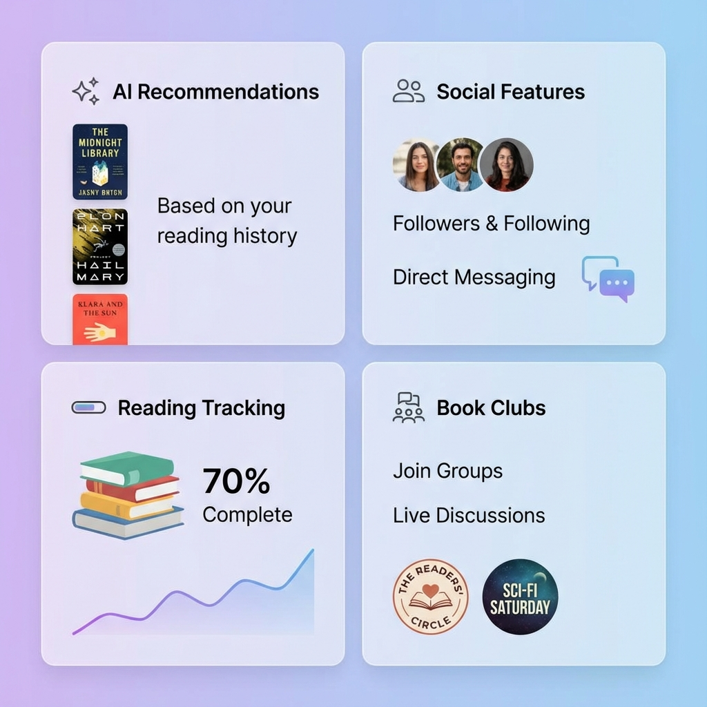
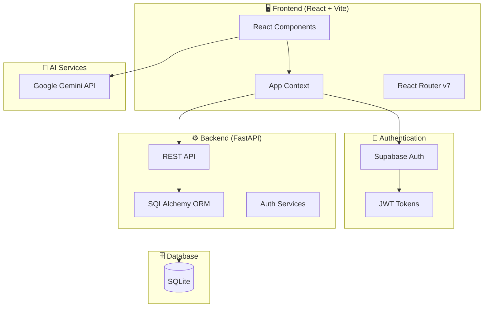

<div align="center">


# 📚 BookNook

### *A Modern, AI-Powered Social Platform for Book Lovers*

[](https://reactjs.org/)
[](https://www.typescriptlang.org/)
[](https://fastapi.tiangolo.com/)
[](https://supabase.com/)
[](https://ai.google.dev/)

[**Live Demo**](https://book-nook-deploy.vercel.app) · [**API Docs**](http://localhost:8000/docs) · [**Report Bug**](../../issues) · [**Request Feature**](../../issues)

</div>

---

## 📖 Overview

**BookNook** is a full-stack web application that reimagines the online reading community. It combines the best of **social networking**, **personal library management**, and **AI-powered recommendations** into one seamless experience.

Whether you're looking to track your reading progress, discover your next favorite book, join book clubs, or connect with fellow readers, BookNook has you covered.


---

## ✨ Key Features



<table>
<tr>
<td width="50%">

### 📱 **User Experience**
- 🔐 **Authentication** via Supabase (Email + Google OAuth)
- 👤 **Rich Profiles** with nickname, bio, age & onboarding flow
- 🌙 **Theme Support** - Light, Dark & Gray modes
- 📊 **Activity Feeds** - Follow & interact with other readers

</td>
<td width="50%">

### 📖 **Library Management**
- 📚 **Reading Status** - Want to Read, Currently Reading, Read
- 📂 **Custom Shelves** - Organize books your way
- ⭐ **Reviews & Ratings** - Share your thoughts
- 💰 **Price Comparison** - Find the best deals

</td>
</tr>
<tr>
<td width="50%">

### 🤝 **Social Features**
- 📝 **Community Posts** - Share updates & discussions
- 👥 **Book Clubs** - Create & join reading groups
- 💬 **Direct Messaging** - Chat with other readers
- ❤️ **Interactions** - Like, dislike & comment on posts

</td>
<td width="50%">

### 🤖 **AI-Powered Intelligence**
- ✨ **Book Concierge** - Personalized vibe-based recommendations
- 🔍 **Deep Insights** - AI-generated literary analysis
- 🤖 **BookBot Chat** - Context-aware assistant
- 📈 **Smart Suggestions** - Based on reading history

</td>
</tr>
</table>

---

## 🏗️ Architecture



---

## 🛠️ Tech Stack

### Frontend
| Technology | Purpose |
|:-----------|:--------|
| **React 19** | UI library with latest features |
| **TypeScript 5.6** | Type safety & developer experience |
| **Vite 6** | Lightning-fast build tool |
| **Tailwind CSS 4** | Utility-first styling |
| **React Router DOM 7** | Client-side routing |
| **Supabase Client** | Authentication & real-time (optional) |
| **Lucide React** | Beautiful icon library |

### Backend
| Technology | Purpose |
|:-----------|:--------|
| **FastAPI** | High-performance async web framework |
| **SQLAlchemy 2.0** | Powerful ORM with async support |
| **SQLite** | Lightweight, embedded database |
| **Python-Jose** | JWT token handling |
| **Pydantic 2** | Data validation & serialization |
| **Passlib** | Secure password hashing |

### AI & Cloud
| Technology | Purpose |
|:-----------|:--------|
| **Google Gemini API** | AI recommendations & insights |
| **Supabase** | Authentication (OAuth, Email, SSO) |
| **Render** | Backend hosting (auto-seed support) |
| **Vercel** | Frontend deployment |

---

## 📂 Project Structure

```
BookNook/
├── 📁 backend/                     # FastAPI Backend
│   ├── requirements.txt            # Python dependencies
│   └── 📁 app/
│       ├── main.py                 # App entry point & startup
│       ├── config.py               # Environment settings
│       ├── database.py             # SQLAlchemy configuration
│       ├── 📁 models/              # 10 database models
│       │   ├── user.py             # User & profile data
│       │   ├── book.py             # Books & price options
│       │   ├── shelf.py            # Reading shelves & status
│       │   ├── author.py           # Author information
│       │   ├── review.py           # Book reviews
│       │   ├── post.py             # Community posts
│       │   ├── group.py            # Book clubs
│       │   ├── message.py          # Direct messages
│       │   ├── interaction.py      # Likes, dislikes, comments
│       │   └── audit_log.py        # Admin activity logs
│       ├── 📁 schemas/             # Pydantic validation schemas
│       ├── 📁 routers/             # 11 API route modules
│       │   ├── auth.py             # Login, register, OAuth
│       │   ├── users.py            # User CRUD & following
│       │   ├── books.py            # Book management
│       │   ├── shelves.py          # Reading status & shelves
│       │   ├── authors.py          # Author operations
│       │   ├── reviews.py          # Review management
│       │   ├── posts.py            # Community posts
│       │   ├── groups.py           # Book clubs
│       │   ├── messages.py         # Direct messaging
│       │   ├── interactions.py     # Like/dislike/comment
│       │   └── admin.py            # Admin dashboard & moderation
│       ├── 📁 services/            # Business logic
│       │   └── auth.py             # Password hashing & JWT
│       └── 📁 utils/
│           └── seed.py             # Database seeding utility
│
├── 📁 frontend/                    # React + Vite Frontend
│   ├── package.json
│   ├── vite.config.ts
│   ├── tailwind.config.js
│   └── 📁 src/
│       ├── App.tsx                 # Main app & routes
│       ├── 📁 components/          # Reusable UI components
│       │   ├── Navbar.tsx          # Navigation bar
│       │   ├── PostCard.tsx        # Post with interactions
│       │   ├── BookCard.tsx        # Book preview card
│       │   ├── ChatBot.tsx         # AI chat interface
│       │   └── StarRating.tsx      # Rating display
│       ├── 📁 context/
│       │   └── AppContext.tsx      # Global state management
│       ├── 📁 pages/               # Route pages
│       │   ├── Home.tsx            # Feed & trending
│       │   ├── BookDetails.tsx     # Book page + AI insights
│       │   ├── Profile.tsx         # User profile + shelves
│       │   ├── UserProfile.tsx     # View other users
│       │   ├── Groups.tsx          # Book clubs listing
│       │   ├── GroupDetails.tsx    # Club page
│       │   ├── Messages.tsx        # DM inbox
│       │   ├── Recommendations.tsx # AI book concierge
│       │   ├── Settings.tsx        # Theme & preferences
│       │   ├── Onboarding.tsx      # Profile completion
│       │   ├── AuthCallback.tsx    # OAuth handler
│       │   └── 📁 admin/           # Admin panel
│       │       ├── Dashboard.tsx   # Stats overview
│       │       ├── UserManager.tsx # User moderation
│       │       ├── BookManager.tsx # Book CRUD
│       │       ├── ContentModeration.tsx
│       │       └── AuditLogs.tsx   # Activity history
│       ├── 📁 services/
│       │   ├── api.ts              # Backend API client
│       │   ├── supabase.ts         # Supabase configuration
│       │   └── geminiService.ts    # Google AI integration
│       └── 📁 types/
│           └── index.ts            # TypeScript interfaces
│
├── 📁 docs/                        # Documentation assets
│   └── 📁 images/                  # README images
├── .gitignore
└── README.md
```

---

## 🚀 Getting Started

### Prerequisites

- **Python** 3.10+ ([Download](https://python.org))
- **Node.js** 18+ ([Download](https://nodejs.org))
- **Google Cloud API Key** for AI features ([Get one](https://ai.google.dev/))
- **Supabase Project** for authentication ([Sign up](https://supabase.com))

### 1️⃣ Clone the Repository

```bash
git clone https://github.com/yourusername/BookNook.git
cd BookNook
```

### 2️⃣ Backend Setup

```bash
# Navigate to backend
cd backend

# Create virtual environment
python -m venv venv

# Activate virtual environment
# Windows:
venv\Scripts\activate
# macOS/Linux:
source venv/bin/activate

# Install dependencies
pip install -r requirements.txt

# Create .env file (optional for advanced config)
echo "SECRET_KEY=your-secret-key-here" > .env

# Seed the database with sample data
python -m app.utils.seed

# Start the development server
uvicorn app.main:app --reload --port 8000
```

### 3️⃣ Frontend Setup

```bash
# Navigate to frontend (from project root)
cd frontend

# Install dependencies
npm install

# Create environment file
cat > .env << EOF
VITE_SUPABASE_URL=your_supabase_url
VITE_SUPABASE_ANON_KEY=your_supabase_anon_key
VITE_GEMINI_API_KEY=your_google_api_key
VITE_API_URL=http://localhost:8000
EOF

# Start development server
npm run dev
```

### 4️⃣ Access the Application

| Service | URL | Description |
|---------|-----|-------------|
| 🖥️ **Frontend** | http://localhost:5173 | Main web application |
| ⚙️ **Backend API** | http://localhost:8000 | REST API |
| 📚 **Swagger Docs** | http://localhost:8000/docs | Interactive API documentation |
| 📖 **ReDoc** | http://localhost:8000/redoc | Alternative API docs |
| 🔧 **Admin Panel** | http://localhost:5173/#/admin | Administration dashboard |

---

## 📡 API Reference

### Authentication
| Method | Endpoint | Description |
|--------|----------|-------------|
| `POST` | `/auth/register` | Register new user |
| `POST` | `/auth/login` | Login with email/password |
| `GET` | `/auth/me` | Get current user profile |
| `PUT` | `/auth/profile` | Update user profile |

### Books & Authors
| Method | Endpoint | Description |
|--------|----------|-------------|
| `GET` | `/books` | List all books |
| `GET` | `/books/{id}` | Get book details |
| `POST` | `/books` | Create book (admin) |
| `GET` | `/authors` | List all authors |

### Reading Status & Shelves
| Method | Endpoint | Description |
|--------|----------|-------------|
| `GET` | `/shelves` | Get user's shelves |
| `POST` | `/shelves` | Create custom shelf |
| `POST` | `/shelves/{id}/books` | Add book to shelf |
| `DELETE` | `/shelves/{id}/books/{book_id}` | Remove from shelf |

### Social Features
| Method | Endpoint | Description |
|--------|----------|-------------|
| `GET` | `/posts` | Get community posts |
| `POST` | `/posts` | Create new post |
| `POST` | `/posts/{id}/like` | Like a post |
| `POST` | `/posts/{id}/comment` | Add comment |
| `GET` | `/groups` | List book clubs |
| `POST` | `/groups/{id}/join` | Join a book club |
| `GET` | `/messages` | Get conversations |
| `POST` | `/messages` | Send a message |

### Admin Endpoints
| Method | Endpoint | Description |
|--------|----------|-------------|
| `GET` | `/admin/dashboard/stats` | Dashboard statistics |
| `GET` | `/admin/users` | List all users |
| `PUT` | `/admin/users/{id}/ban` | Ban/unban user |
| `GET` | `/admin/audit-logs` | View activity logs |

> 📖 **Full API documentation available at** `/docs` when running the backend.

---

## 🛡️ Admin Panel

Access the secure admin dashboard at `/admin` (separate authentication).

### Default Admin Credentials

| Field | Value |
|-------|-------|
| **Email** | `admin@booknook.com` |
| **Password** | `admin123` |

> ⚠️ **Important:** Change these credentials in production!

### Admin Features

| Feature | Description |
|---------|-------------|
| **📊 Dashboard** | User counts, content stats, activity charts |
| **👥 User Management** | View, ban, promote to admin, delete users |
| **📚 Book Management** | Full CRUD operations on books |
| **📝 Content Moderation** | Approve/reject pending reviews & posts |
| **📜 Audit Logs** | Complete history of admin actions |

---

## 🤖 AI Features

BookNook integrates **Google Gemini API** for intelligent features:

### Book Concierge 🎯
- Describe your mood, preferences, or reading vibes
- Get personalized book recommendations
- Natural language conversation interface

### Deep Insights 🔍
- AI-generated literary analysis on book pages
- Themes, writing style, and reader recommendations
- One-click generation from book details

### BookBot Assistant 💬
- Context-aware chatbot for book-related queries
- Recommendations, summaries, and discussions
- Available across the platform

### Setup AI Features

1. Get a Google AI API key from [ai.google.dev](https://ai.google.dev/)
2. Add to `frontend/.env`:
   ```
   VITE_GEMINI_API_KEY=your_api_key_here
   ```

---

## 🎨 Theming

BookNook supports multiple themes for comfortable reading:

| Theme | Description |
|-------|-------------|
| ☀️ **Light** | Clean, bright interface for daytime use |
| 🌙 **Dark** | Easy on the eyes for night reading |
| 🌫️ **Gray** | Neutral, low-contrast option |

Switch themes anytime from **Settings** → **Appearance**.

---

## 🚢 Deployment

### Backend (Render)

1. Create a new **Web Service** on [Render](https://render.com)
2. Connect your GitHub repository
3. Configure:
   - **Build Command:** `pip install -r requirements.txt`
   - **Start Command:** `uvicorn app.main:app --host 0.0.0.0 --port $PORT`
4. Add environment variables:
   ```
   SECRET_KEY=your-production-secret
   FRONTEND_URL=https://your-frontend.vercel.app
   ```

> 💡 The backend auto-seeds the database on first deployment when running on Render.

### Frontend (Vercel)

1. Import project to [Vercel](https://vercel.com)
2. Set root directory to `frontend`
3. Add environment variables:
   ```
   VITE_API_URL=https://your-backend.onrender.com
   VITE_SUPABASE_URL=your_supabase_url
   VITE_SUPABASE_ANON_KEY=your_supabase_key
   VITE_GEMINI_API_KEY=your_gemini_key
   ```
4. Deploy!

---

## 🤝 Contributing

Contributions are welcome! Please feel free to submit a Pull Request.

1. Fork the repository
2. Create your feature branch (`git checkout -b feature/AmazingFeature`)
3. Commit your changes (`git commit -m 'Add some AmazingFeature'`)
4. Push to the branch (`git push origin feature/AmazingFeature`)
5. Open a Pull Request

---

## 📄 License

Distributed under the **MIT License**. See `LICENSE` for more information.

---

<div align="center">

**Made with ❤️ for book lovers everywhere**

[⬆ Back to Top](#-booknook)

</div>
